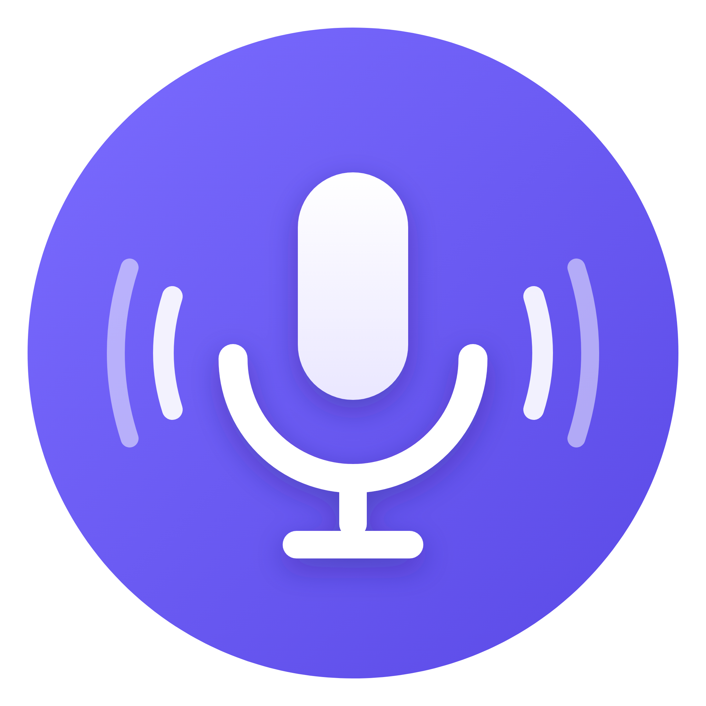

# 🎙️ Adobe Podcast Batch

App de escritorio (macOS) para limpiar audio **por lote** con el modelo de
**Adobe Podcast — Enhance Speech (v2)**, sin depender de la interfaz web.

Pensada para equipos de edición de video/podcast: metés una carpeta con decenas
de audios y te devuelve todos limpios, cada uno junto al original.



## Características

- 🔐 **Login embebido de Adobe** — te logueás dentro de la app y extrae el token
  solo. La sesión queda guardada; al reabrir se reconecta sin pedirte nada.
- 📁 **Lote real** — audios sueltos, carpeta entera o arrastrar y soltar.
- ⚡ **Procesa 5 a la vez** con cola y estado por archivo.
- ⏳ **Manejo de créditos** — si Adobe corta por límite, muestra una cuenta
  regresiva y **reanuda solo** cuando se libera.
- 🎚️ Slider **Voz limpia %** (dry/wet): 100% = voz totalmente limpia; menos =
  mezcla local con el original para un resultado más natural (motor ffmpeg bundleado).
- ⚡ Procesa hasta **5 audios en paralelo**.
- 💾 **Salida** con el mismo nombre en una carpeta `Enhanced/` junto al original.
  Al 100% la voz limpia sale directo en `Enhanced/`; con menos de 100% la mezcla
  final queda en `Enhanced/` y la voz 100% limpia se guarda en `Enhanced/Clean voice/`.

## Descargar

Desde la sección [**Releases**](../../releases/latest):

- **macOS (Apple Silicon):** `Adobe-Podcast-Batch-1.0.0-arm64.dmg`
  Como no está firmada con Apple, la primera vez abrila con **clic derecho → Abrir**.
- **Windows (x64):** `Adobe-Podcast-Batch-1.0.0-win-x64.zip`
  Descomprimí y ejecutá `Adobe Podcast Batch.exe`. Windows SmartScreen puede
  pedir **Más información → Ejecutar de todas formas** (app sin firmar).

## Desarrollo

```bash
npm install
npm start          # correr en dev
npm run icon       # regenerar el ícono (build/icon.icns)
npm run dist       # empaquetar DMG de macOS en dist/

# Windows (portable .zip) — se compila desde cualquier SO, sin wine:
npx electron-packager . "Adobe Podcast Batch" --platform=win32 --arch=x64 \
  --icon=build/icon.ico --overwrite --out=build-win --ignore=dist --ignore=build-win
```

Multiplataforma: **macOS (Apple Silicon)** y **Windows (x64)**.

## Cómo funciona

Usa el endpoint interno `phonos-server-flex.adobe.io` que alimenta la web de
Adobe Podcast: sube el audio, crea un track de *enhance speech*, espera el
procesamiento y descarga el resultado. El token de sesión de Adobe se obtiene
del login embebido (nunca se guarda en el repo).

## Privacidad / seguridad

- El token de Adobe se guarda **solo localmente** (archivo `token.dat` en la
  carpeta de datos de la app, cifrado con el llavero del sistema cuando está
  disponible). No se sube a ningún lado.
- No hay claves ni secretos en el código.

## Aviso

Proyecto no oficial, sin relación con Adobe. Usa un endpoint interno que puede
cambiar sin aviso. MIT License.
